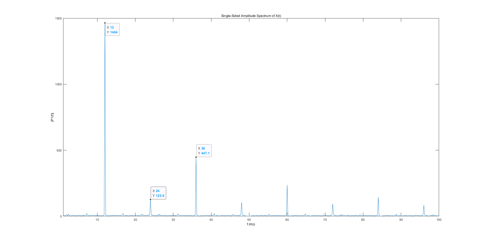

# Freq_eval

## 1. Test frequency acuracy, via photocell testing.

## 2. Test frequency acuracy, via video-to-frame analysis.

## 3. Multi-window stability test, via photocell testing.

## 4. Test stimulator on different machine taking 12Hz for insitance.

### (1) Desktop computer(RAM:32GB, GPU:NVIDIA Quadro RTX 4000, Screen refresh rate: 60Hz)

### (2) Notebook computer()

## Supplyment
### 1. Test the influence of channels, taking 12Hz for insitance.
**(1) Signal channel on Desktop computer(RAM:32GB, GPU:NVIDIA Quadro RTX 4000, Screen refresh rate: 60Hz)**

**(2) No-signal channel on Desktop computer(RAM:32GB, GPU:NVIDIA Quadro RTX 4000, Screen refresh rate: 60Hz)**

