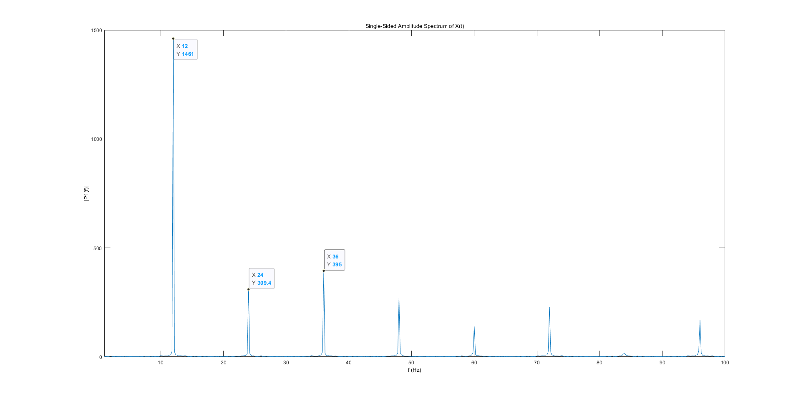
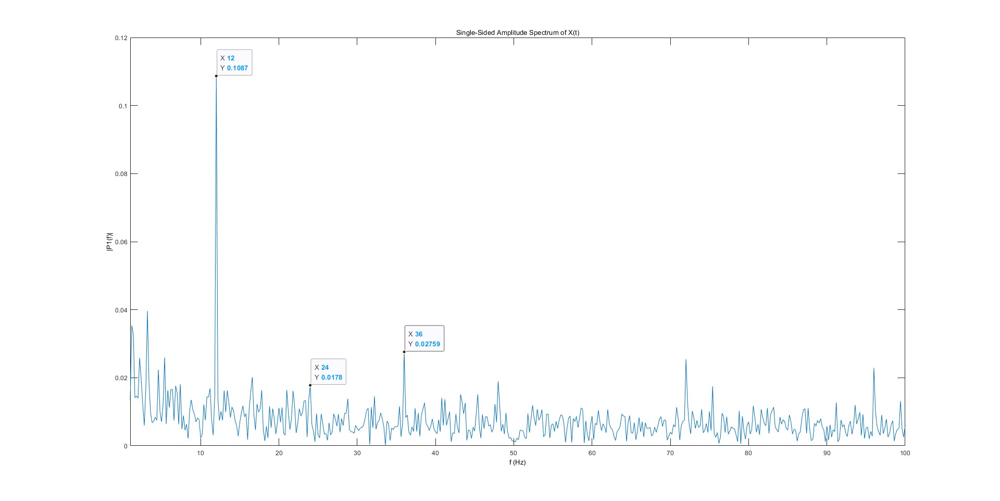

# Freq_eval

## 1. Test frequency acuracy

## 2. Test stimulator on different machine

### (1) Desktop computer()

### (2) Notebook computer()

## Supplyment

### (1) Signal channel on Desktop computer() 

### (2) No-signal channel on Desktop computer()

