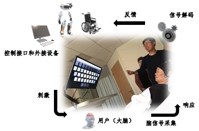
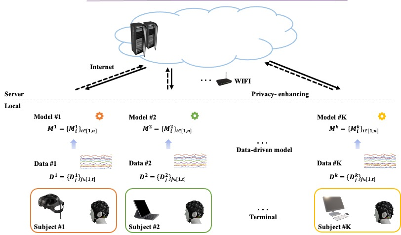

# A Novel Engine for Brain-computer Interfaces

## What is it?

## Usage Locally

## Modules and Vital Functions

### 1. Software Design Automation

* Multi-task... 
     
   Ref: Learn2Reg: comprehensive multi-task medical image registration challenge, dataset and evaluation in the era of deep learning 
 
* EEG and EOG based Computer Input Device: 
 

***Slack1: Non-invasive Brain-computer Interface based Controlling of Computer Input Devices*** 

   Ref: Noninvasive neuroimagning enhances continuous neural tracking for robotic device control

### 2. Interactive Interface Rendering

 **Pipeline**
 

**Evaluate**

**Dependency**

* OpenGL: GLM-0.9.9.8, GLFW, GLAD
* Freetype-2.12.1
 
### 3. CCA based Plug-and-Play BCI
 https://github.com/aaravindravi/PythonBox_OpenViBE_SSVEP_CCA/blob/master/4ClassCCA.py
 
 
### 4. Communication module
  https://realpython.com/python-sockets/ 
  
  Socket API: https://docs.python.org/3/library/socket.html
  
  **C++-coded client && python-coded server**: 
  1. 利用socket实现python与C++连续通信 https://blog.csdn.net/qq_33485434/article/details/88050577 ，
  2. 利用socket实现C++与python的通信，实现手势识别结果的传输 https://blog.csdn.net/lifeisme666/article/details/117876854?spm=1001.2101.3001.6650.1&utm_medium=distribute.pc_relevant.none-task-blog-2%7Edefault%7ECTRLIST%7ERate-1-117876854-blog-88050577.pc_relevant_default&depth_1-utm_source=distribute.pc_relevant.none-task-blog-2%7Edefault%7ECTRLIST%7ERate-1-117876854-blog-88050577.pc_relevant_default&utm_relevant_index=2 ， 
  3. Python 与 C++ 的进程通信 https://blog.csdn.net/weixin_43152152/article/details/127764569?spm=1001.2101.3001.6650.1&utm_medium=distribute.pc_relevant.none-task-blog-2%7Edefault%7ECTRLIST%7ERate-1-127764569-blog-88050577.pc_relevant_default&depth_1-utm_source=distribute.pc_relevant.none-task-blog-2%7Edefault%7ECTRLIST%7ERate-1-127764569-blog-88050577.pc_relevant_default&utm_relevant_index=1
  4. Python 与 C++ 的进程通信 https://blog.csdn.net/weixin_43152152/article/details/127764569?spm=1001.2101.3001.6650.1&utm_medium=distribute.pc_relevant.none-task-blog-2%7Edefault%7ECTRLIST%7ERate-1-127764569-blog-88050577.pc_relevant_default&depth_1-utm_source=distribute.pc_relevant.none-task-blog-2%7Edefault%7ECTRLIST%7ERate-1-127764569-blog-88050577.pc_relevant_default&utm_relevant_index=1
  5. Python 与 C++ 的进程通信 python之socket编程 https://www.cnblogs.com/aylin/p/5572104.html
  

## Core Technology（Only for Shaoyang and Bo）

### 1. Time synchronization
Ref: Lab Streaming Layer (LSL), https://github.com/sccn/labstreaminglayer

### 2. The primary execution thread and other auxiliary thread
Discuss: What are the primary execution thread and the auxiliary thread in our system?

### 3. Transparent  
https://learnopengl-cn.github.io/04%20Advanced%20OpenGL/03%20Blending/

## Environment
*Cross-platform*

 **1. For Windows:** 
 
 Ref: 
 Qt OpenGL https://doc.qt.io/qt-6/qtopengl-index.html  
 Qt OpenGL Demo https://zhuanlan.zhihu.com/p/97457249, https://github.com/linmx0130/QGLDemo/tree/ch0 
 
 
## Architecture

 **System Development Discussion**

Temporal Signal Testing and Target Selection:
"Continuous testing operations are performed on temporal signals. If the confidence level demonstrates a stable upward trend, it is inferred that the user is selecting a specific target. Conversely, if the confidence level initially declines and subsequently rises, it indicates that the user is switching targets."
Multi-Tasking and EEG-Based Transfer Learning:
"Implement multi-tasking functionality based on an expanded interactive interface. Employ transfer learning techniques utilizing EEG signals."
Time Synchronization:
"Implement server-side time synchronization, with periodic time correction between the server and client to replace parallel port triggering." Or another possible translation is: "Time stamping/synchronization. Server-side time stamping, with periodical time calibration between client and server, to replace parrallel port triggers."
Wi-Fi for EEG Data Transmission:
"Utilize Wi-Fi for EEG data transmission due to its higher bandwidth capacity compared to Bluetooth."
DSI Function Modification:
"Modify DSI functions to enable the integration of new hardware."
Port Number Assignment:
"Assign the port number corresponding to NeuroScan's port assignment." 
Explanation of Key Terms and Nuances:

**Temporal Signals:**
This refers to signals that vary over time, crucial in analyzing dynamic systems like brain activity.
Confidence Level:
This represents the probability or certainty associated with a specific interpretation of the signal.
**Transfer Learning:**
A machine learning technique where a model trained on one task is repurposed as a starting point for a model on a second related task. This is highly useful when data is sparse for a target task, but very abundant for a related source task.
**EEG (Electroencephalography):**
A non-invasive method for recording electrical activity in the brain.
DSI (Dense Sensor Interface):
This is a term that could have specialized context, but from the surrounding context, would be assumed to be relating to how the system is interfacing with its sensors, so a modification of the DSI function, would mean a modification to how the sensor data is being handled.
NeuroScan:
This is known to be a company that produces equipment used for neurophysiological measurement.
Key Considerations:

When working with EEG data, accuracy and low latency are paramount. The choice of Wi-Fi reflects this need.
Transfer learning is valuable in brain-computer interfaces (BCIs) due to the variability of EEG signals between individuals.
Accurate Time synchronization is very important in the acquirement of EEG data.

